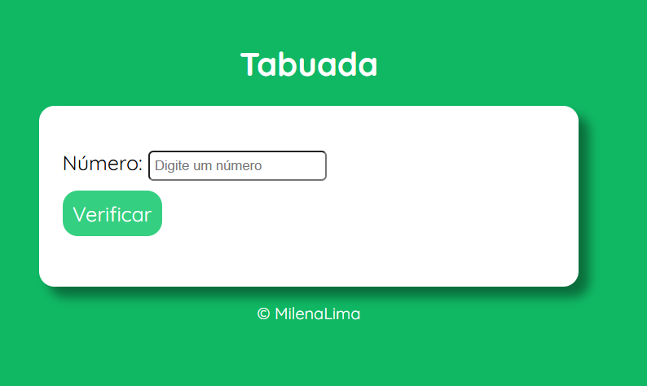
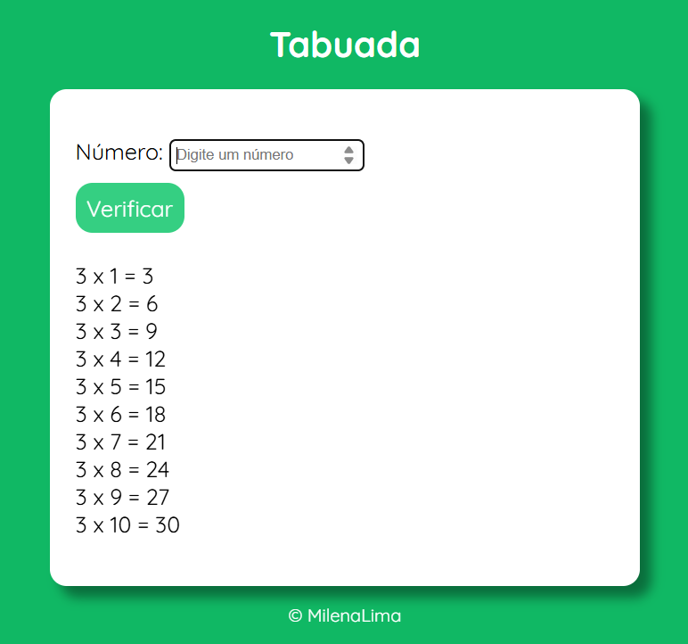

# 🚀 Projeto Idade 

Este é um projeto simples de tabuada desenvolvido com **HTML, CSS e JavaScript**. Ele permite que o usuário digite um número, clique no botão "Verificar" e veja a tabuada correspondente de 1 a 10.  
📌 Desenvolvido como parte das aulas do **Professor Guanabara - Curso em Vídeo**.   

---

## 🎯 Funcionalidades  

✔️ O usuário digita um número em um campo de entrada.  
✔️ Ao clicar no botão, a tabuada desse número é gerada e exibida na tela.  
✔️ O campo de entrada é automaticamente limpo após o envio.   
✔️ O foco retorna ao campo de entrada para facilitar uma nova digitação.  

---

## 🚀 Tecnologias Utilizadas

- **HTML5** → Estrutura da página  
- **CSS3** → Estilização e layout responsivo   
- **JavaScript** → Lógica para calcular e exibir a tabuada  

---

## 📷 Demonstração  
🔹 **Tela Inicialmente**  
  

🔹 **Exemplo do Resultado da Tabuada**  
  
